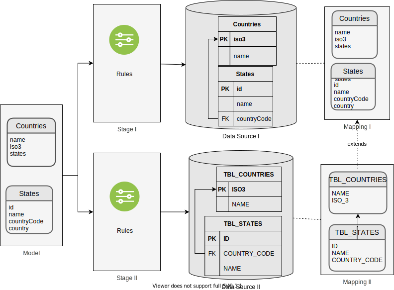

# CLI Lab - Two stages

**In this laboratory we will see:**

- how to work with two sources with different mappings
- how to define two stages and work with them
- how to use environment variables to set connections to databases
- How to insert data from a file to more than one table.
- how to use imported data from one stage to import it to another

## Schema diagram

In this scheme we can see how to extend the schema.



## Lab

### Install lambda ORM CLI

Install the package globally to use the CLI commands to help you create and maintain projects

```sh
npm install lambdaorm-cli -g
```

Test

```sh
lambdaorm version
```

### Create project

will create the project folder with the basic structure.

```sh
lambdaorm init -w lab
```

position inside the project folder.

```sh
cd lab
```

### Create database for test

Add file "docker-compose.yaml"

```yaml
version: '3'
services:
  mysql:
    container_name: lab-mysql
    image: mysql:5.7
    restart: always
    environment:
      - MYSQL_DATABASE=test
      - MYSQL_USER=test
      - MYSQL_PASSWORD=test
      - MYSQL_ROOT_PASSWORD=root
    ports:
      - 3306:3306
  postgres:
    container_name: lab-postgres
    image: postgres:10
    restart: always
    environment:
      - POSTGRES_DB=test
      - POSTGRES_USER=test
      - POSTGRES_PASSWORD=test
    ports:
      - 5432:5432
```

Create MySql and Postgres databases for test:

```sh
docker-compose -p "lambdaorm-lab" up -d
```

Create user and set character:

```sh
docker exec lab-mysql mysql --host 127.0.0.1 --port 3306 -uroot -proot -e "ALTER DATABASE test CHARACTER SET utf8 COLLATE utf8_general_ci;"
docker exec lab-mysql mysql --host 127.0.0.1 --port 3306 -uroot -proot -e "GRANT ALL ON *.* TO 'test'@'%' with grant option; FLUSH PRIVILEGES;"
```

### Add environment file

Add file ".env"

```sh
CNN_MYSQL={"host":"localhost","port":3306,"user":"test","password":"test","database":"test"}
CNN_POSTGRES={"host":"localhost","port":5432,"user":"test","password":"test","database":"test"}
```

### Complete Schema

In the creation of the project, the schema was created in the file lambdaORM.yaml with the initial configuration of example\
We will replace this configuration with the following where the following changes are made:

- Added Country and State entities
- The mapping "test" was replaced by "mapping1" and "mapping2"
- Replaced the "test" source with "source1" and "source2" , which use environment variables to set up the connection
- The stages were replaced by the stages "stage1" and "stage2"

Modify file "lambdaORM.yaml"

```yaml
domain:
  entities:
    - name: Countries
      primaryKey: ["iso3"]
      uniqueKey: ["name"]
      properties:
        - name: name
          required: true
        - name: iso3
          length: 3
          required: true
      relations:
        - name: states
          type: manyToOne
          composite: true
          from: iso3
          entity: States
          to: countryCode
    - name: States
      primaryKey: ["id"]
      uniqueKey: ["countryCode", "name"]
      properties:
        - name: id
          type: integer
          required: true
        - name: name
          required: true
        - name: countryCode
          required: true
          length: 3
      relations:
        - name: country
          from: countryCode
          entity: Countries
          to: iso3
infrastructure:
  mappings:
    - name: mapping1
    - name: mapping2
      entities:
        - name: Countries
          mapping: TBL_COUNTRIES
          properties:
            - name: iso3
              mapping: ISO3
            - name: name
              mapping: NAME
        - name: States
          mapping: TBL_STATES
          properties:
            - name: id
              mapping: ID
            - name: name
              mapping: NAME
            - name: countryCode
              mapping: COUNTRY_CODE
  sources:
    - name: source1
      dialect: MySQL
      mapping: mapping1
      connection: ${CNN_MYSQL}
    - name: source2
      dialect: PostgreSQL
      mapping: mapping2
      connection: ${CNN_POSTGRES}
  stages:
    - name: stage1
      sources:
        - name: source1
    - name: stage2
      sources:
        - name: source2 
```

With this configuration we can work with two stages.

- Stage1 uses the MySQL database with mapping1 , which does not modify any properties.
- Stage2 uses the PostgreSQL database with the mapping2 which changes the name of the properties

### Sync

```sh
lambdaorm sync -s stage1 -e .env
lambdaorm sync -s stage2 -e .env
```

It will generate:

- the Counties and States tables in database test and a status file "stage1-model.json" in the "data" folder.
- the TBL_COUNTRIES and TBL_STATES tables in database test2 and a status file "stage2-model.json" in the "data" folder.

Structure:

```sh
├── data
│   ├── stage1-ddl-20231123T014514350Z-sync-source1.sql
│   ├── stage1-model.json
│   ├── stage2-ddl-20231123T014521625Z-sync-source2.sql
│   └── stage2-model.json
├── docker-compose.yaml
├── lambdaORM.yaml
├── package.json
├── src
│   └── countries
│       └── domain
│           ├── model.ts
│           ├── repositoryCountry.ts
│           └── repositoryState.ts
```

### Populate Data

for the import we will download the following file.

```sh
wget https://raw.githubusercontent.com/FlavioLionelRita/lambdaorm-labs/main/source/countries/data.json
```

then we will execute the following command

```sh
lambdaorm execute -s stage1 -e .env -q  "Countries.bulkInsert().include(p => p.states)" -d ./data.json 
lambdaorm execute -s stage2 -e .env -q  "Countries.bulkInsert().include(p => p.states)" -d ./data.json 
```

test:

```sh
lambdaorm execute -s stage1 -e .env -q  "Countries.page(1,10).include(p => p.states)"
lambdaorm execute -s stage2 -e .env -q  "Countries.page(1,10).include(p => p.states)"
```

### Delete data in Countries and states in stage2

```sh
lambdaorm execute -s stage2 -e .env -q  "States.deleteAll()"
lambdaorm execute -s stage2 -e .env -q  "Countries.deleteAll()"
```

verify delete data on stage 2:

```sh
lambdaorm execute -s stage2 -e .env -q  "Countries.map(p=> count(1))"
```

### Export data from stage1

```sh
lambdaorm export  -s stage1 -e .env 
```

the stage1-export.json file will be created

### Import in stage2 from data exported from stage1

```sh
lambdaorm import -s stage2 -e .env -d ./stage1-export.json
```

test:

```sh
lambdaorm execute -s stage2 -e .env -q  "Countries.map(p=> count(1))"
lambdaorm execute -s stage2 -e .env -q  "Countries.page(1,10).include(p => p.states)"
```

### Drop

remove all tables from the schema and delete the state file stage1-state.json and stage2-state.json

```sh
lambdaorm drop -s stage1 -e .env
lambdaorm drop -s stage2 -e .env
```

## End

### Remove database for test

Remove databases:

```sh
docker-compose -p "lambdaorm-lab" down
```
