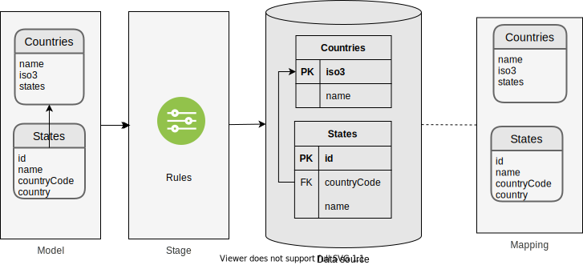

# Lab Node - Repository

**In this laboratory we will see:**

- how to create a project that uses lambda ORM with CLI
- How configure the schema
- How to synchronize the database  with lambda ORM CLI
- How to consume the lambda ORM library in a Node application
- How to use repository pattern with lambdaorm
- How to drop a schema using lambda CLI

## Schema diagram

The schema defines how the entities of the model are mapped with the database tables.



## Pre-requisites

### Install lambda ORM CLI

Install the package globally to use the CLI commands to help you create and maintain projects

```sh
npm install lambdaorm-cli -g
```

## Create project

will create the project folder with the basic structure.

```sh
lambdaorm init -w lab
cd lab
```

## Configure

### Configure docker-compose

Create docker-compose file to create a postgres database

Create file "docker-compose.yaml"

```yaml
version: '3'
services:
  postgres:
    container_name: lab-postgres
    image: postgres:10
    restart: always
    environment:
      - POSTGRES_DB=test
      - POSTGRES_USER=test
      - POSTGRES_PASSWORD=test
    ports:
      - '5436:5432' 
```

### Configure Schema

In the schema we will configure:

- Domain
  - Entities
    - Country
    - State
- Infrastructure
  - Default source
  - Default stage
  - Paths

Since in the creation of the project the schema was created but without any entity. \
Add the Country and State entity as seen in the following example to the "lambdaorm.yaml" file

```yaml
domain:
  entities:
    - name: Countries
      primaryKey: ["iso3"]
      uniqueKey: ["name"]
      properties:
        - name: name
          required: true
        - name: iso3
          required: true
          length: 3
      relations:
        - name: states
          type: manyToOne
          composite: true
          from: iso3
          entity: States
          to: countryCode
    - name: States
      primaryKey: ["id"]
      uniqueKey: ["countryCode", "name"]
      properties:
        - name: id
          type: integer
          required: true
        - name: name
          required: true
        - name: countryCode
          required: true
          length: 3
      relations:
        - name: country
          from: countryCode
          entity: Countries
          to: iso3
infrastructure:
  sources:
    - name: default
      dialect: PostgreSQL
      mapping: default
      connection:
        host: localhost
        port: 5436
        user: test
        password: test
        database: test
  stages:
    - name: default
      sources:
        - name: default
  paths:
    src: src
    domain: countries/domain
```

### Build

Running the build command will create or update the following:

- Folder that will contain the source code and is taken from the "infrastructure.paths.scr" configuration in the lambdaorm.yaml file
- Folder that will contain the domain files, the path is relative to the src folder and is taken from the "infrastructure.paths.domain" configuration in the lambdaorm.yaml file
- Model file: file with the definition of the entities
- Repository files: one file for each entity with data access methods
- Install the necessary dependencies according to the databases used

```sh
lambdaorm build -l node
```

Result:

```sh
├── data
├── docker-compose.yaml
├── lambdaORM.yaml
├── package.json
├── src
│   └── countries
│       └── domain
│           ├── model.ts
│           ├── repositoryCountry.ts
│           └── repositoryState.ts
└── tsconfig.json
```

## Start

### Create infrastructure

Create database for test:

```sh
docker-compose -p lambdaorm-lab up -d
```

### Push

When executing the sync command, ddl code will be executed according to the definition in the lambdaorm schema file.

- Tables, indexes and keys will be created
- The executed code is added to a file in the data folder.
- The [source-name]-model.json file will be created or updated which maintains the source state since the last synchronization.

```sh
lambdaorm push
```

Files generated:

```sh
├── data
│   ├── default-ddl-20231202T163012473Z-push-default.sql
│   └── default-model.json
```

### Add Source Code

In the src folder add the file "index.ts" with the following content:

```ts
import { orm } from 'lambdaorm'
import { Country } from './countries/domain/model'
import { CountryRepository } from './countries/domain/repositoryCountry'
import { StateRepository } from './countries/domain/repositoryState'
(async () => {
	try {
    // Initialize the ORM by passing the schema file
    await orm.init('./lambdaORM.yaml')
    const countryRepository = new CountryRepository()
    // Insert the country and associated states       
    let country:Country = { name: 'Argentina' , iso3: 'ARG', states:[{id:1, name:'Bs As'}, {id:2 ,name:'Cordoba'}] } 
    country = await countryRepository.insert(country, (p => p.states))    
    console.log(JSON.stringify(country))    
    let originalName    
    // Get record    
    const arg = await countryRepository.first({},(p => p.iso3 === 'ARG'))
    if (arg){
        console.log(`name is ${arg.name}`)
        originalName = arg.name
        // modify and update
        arg.name =  arg.name + '1'
        await countryRepository.update(arg)
    }
    // get record modified and set original name
    const modified = await countryRepository.first({},(p => p.iso3 === 'ARG'))
    if (modified){
        console.log(`name is ${modified.name}`)
        modified.name =  originalName
        await countryRepository.update(modified)
    }
    // Delete all records from tables
    if (modified){
        await (new StateRepository()).deleteAll({},(p => p.countryCode=== 'ARG'))
        await countryRepository.delete(modified)
    }    
	} catch (error: any) {
		console.error(error)
	} finally{
        await orm.end()
    }
})()
```

### Structure

```sh
├── data
│   ├── default-ddl-20231202T163012473Z-push-default.sql
│   └── default-model.json
├── docker-compose.yaml
├── lambdaORM.yaml
├── package.json
├── src
│   ├── countries
│   │   └── domain
│   │       ├── model.ts
│   │       ├── repositoryCountry.ts
│   │       └── repositoryState.ts
│   └── index.ts
└── tsconfig.json
```

### Run

```sh
npx tsc
node ./build/index.js
```

**Result:**

```sh
{"data":{"name":"Argentina","iso3":"ARG","states":[{"id":1,"name":"Bs As","countryCode":"ARG"},{"id":2,"name":"Cordoba","countryCode":"ARG"}]}}
name is Argentina
name is Argentina1
```

## End

Drop tables associates to default stage and down containers

```sh
lambdaorm drop
docker-compose -p "lambdaorm-lab" down
```
